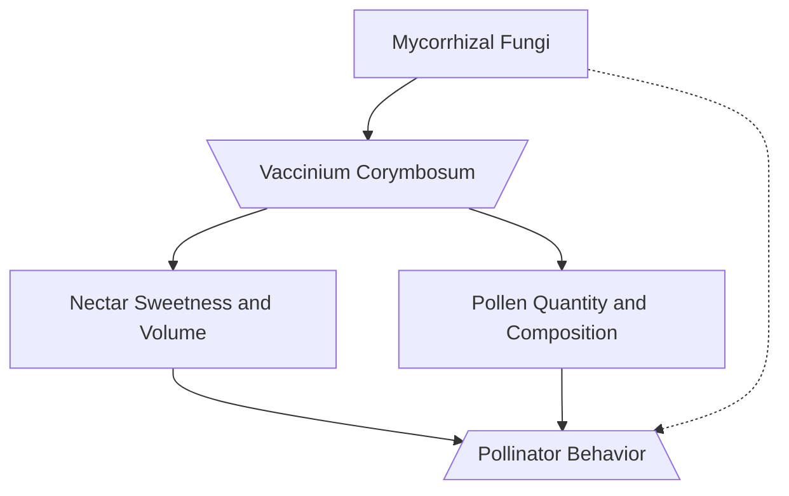

# Level 1 Header

## Level 2 Header

### Level 3 Header

#### Level 4 Header

##### Level 5 Header

###### Level 6 Header

---

Un-ordered list:

* list item one
* list item 2
* list item 3


Ordered list:

1. List item one
2. List item 2
3. List item 3

<br/>


***

An [inline link](https://support.typora.io/Markdown-Reference/#links) is created using parentheses containing a URL after the link 

This is [an example][id] reference-style link.

You can define your link label on a line by itself like this

[id]: http://google.com/ "optional title"

[Google][]

[Google]: http://google.com/

A reference link to google can be made with brackets: [google][http://google.com/]

***

The Simplified Blueberry Project 


> A block quote can be inserted using a ">" before the line. 
>
> > Nested block 
> >
> > > quotes are also
> > >
> > > > possible
> > >
> > > like 
> >
> > this
>
> .


---

```
#three apostrophes make a plain block
```


```R
#three apostrophes and "R"make an R code block
```


Math code block (centered) is made using 2 dollar signs


$$
y = (x,t)e^{i/theta}\\
$$


Inline blocks are made using one dollar sign $4$ $y=mx+b$ 

***

| First Header | Second Header |
| ------------ | ------------- |
| cell 1       | cell 2        |
| cell 3       | cell 4        |


---


Flow charts are made using ""```Mermaid"

* instructions can be found [here](https://mermaid-js.github.io/mermaid/#/flowchart?id=graph)



